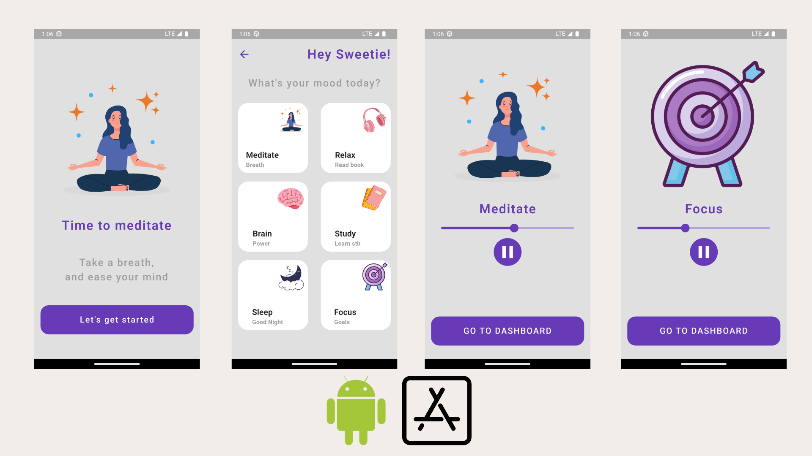

# Mediatation App

An app that make you calm, relief, relax, and focus 🧘

### Screens



**Meditation App** is a cross-platform application designed to assist users in improving their mental well-being. The app provides a variety of calming music and relaxing experiences with a clean and intuitive UI. Whether you want to meditate, relax, focus, study, or sleep, this app has a mode for you.

## Features

- 🎵 Play, pause, and stop music suitable for different activities (meditation, relaxation, focus, study, sleep, and brain power).
- 🖼️ Visually appealing and simple user interface.
- 📱 Built using Flutter for cross-platform compatibility (Android, iOS, Linux, Windows).
- 🇬🇧 English language support.
- 🎧 Quick access to different soundtracks, each tailored to a specific mood or activity.
- 🔊 Audio playback powered by the `audioplayer` package.

## App Screens


- Each mode (Meditate, Relax, Focus, Study, Sleep, Brain) comes with its own image and music track.
- Easily switch between modes to suit your current needs.

## Music Modes & Assets

| Mode      | Subtitle    | Image            | Music File        |
|-----------|-------------|------------------|-------------------|
| Meditate  | Breath      | meditation.png   | meditation.mp3    |
| Relax     | Read book   | relax.png        | relax.mp3         |
| Focus     | Goals       | focus.png        | focus.mp3         |
| Study     | Learn sth   | study.png        | study.mp3         |
| Sleep     | Good Night  | sleep.png        | sleep.mp3         |
| Brain     | Power       | brain.png        | brain.mp3         |

All assets are located in the `assets/images` and `assets/audio` directories.

## Packages Used

- [`audioplayer`](https://pub.dev/packages/audioplayer) - For music playback.

## Getting Started

1. **Clone this repository**
    ```bash
    git clone https://github.com/chandan-athreya-s/madsee.git
    cd madsee
    ```
2. **Install dependencies**
    ```bash
    flutter packages get
    ```
3. **Run the app**
    ```bash
    flutter run
    ```

You can also build and run the app for specific platforms (Linux, Windows) using:
```bash
flutter run -d linux
flutter run -d windows
```

## Project Structure

- `lib/` : Main Dart source code.
    - `utils/assets.dart` : Contains constants for image and audio assets.
- `assets/images/` : All image assets for UI.
- `assets/audio/` : All music tracks used in the app.
- `windows/` and `linux/` : Platform-specific configuration and build files.
- `README.md` : You are here!

## Authors

- [Chandan Athreya S](https://github.com/chandan-athreya-s)
- B M Madhuchandra

**Original inspiration and some assets by [Phat Panhareach (Re4ch-Jay)](https://github.com/Re4ch-Jay/)**

---

Enjoy your journey to mindfulness and focus!  
Feel free to open issues or suggest improvements.


